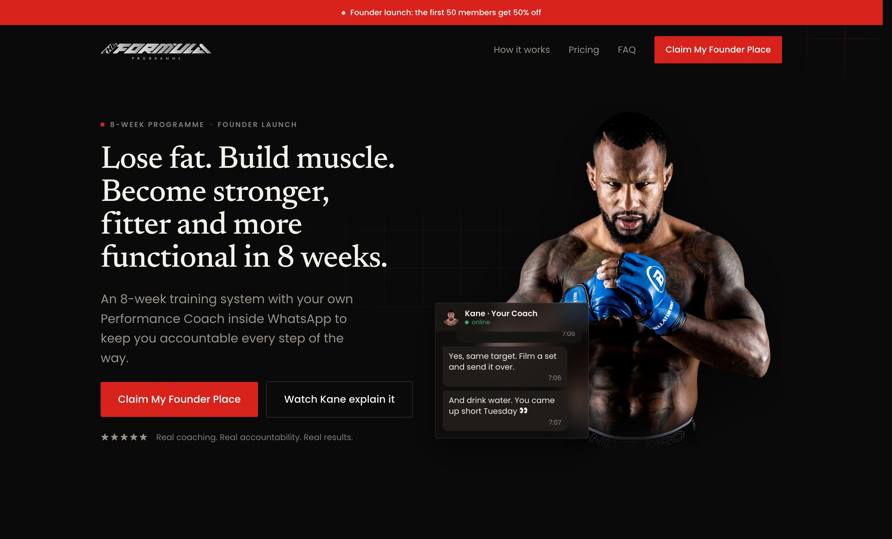

<div align="center">

<picture>
  <source media="(prefers-color-scheme: dark)" srcset="public/logo.svg">
  
</picture>

<br><br>

**Marketing and checkout site for Kane Mousah's 8-week fitness programme.**

      

| Tests | CI gates per PR | Components | Email templates | Migrations |
| :---: | :---: | :---: | :---: | :---: |
| 405 <sub>(337 unit · 33 integration · 35 e2e)</sub> | 10 | 77 | 6 | 14 |

</div>

Visitors watch the pitch, pay, and get onboarded into the programme;
everything else in this repo exists to make that one path fast, honest, and
hard to break.

<p align="center">
  
</p>

Runs on Vercel. Merging to `main` deploys to production, so `main` only moves
by pull request.

## Stack

Three layers: the page you see, the money path behind it, and the guard rails
around both.

|  | What | Why it's here |
| --- | --- | --- |
| **Framework** | Next.js 16 (App Router, RSC) · React 19 · TypeScript | One deployable, server-first by default |
| **Styling** | Tailwind CSS v4 | Design tokens live in `@theme`, not a config file |
| **UI** | Base UI · shadcn-style components · Motion · Mux | Accessible primitives, animation, and the sales video |
| **Payments** | Stripe hosted Checkout | One-off entry fee + trial subscription; webhooks land on `/api/stripe/webhook`, a daily reconcile backfills anything they miss |
| **Database** | Prisma + Postgres (Supabase prod, Docker local) | System of record for leads and purchases |
| **Jobs** | Trigger.dev | Emails, CRM sync, PDF watermarking, off the request path |
| **Email** | Resend + React Email | Transactional email, templates in `src/emails/` |
| **CRM** | GoHighLevel | Membership tags on the contact are what actually grant programme access |
| **Storage** | Vercel Blob (private) | The programme PDF, watermarked per purchase |
| **Guard rails** | Zod + next-safe-action · Turnstile · Upstash rate limits · Sentry · PostHog (EU) | Validated mutations, bot-proofed forms, capped abuse, observed failures |

## Getting started

You need Node 22+, pnpm, and Docker.

```bash
pnpm install
cp .env.example .env.local   # then fill in the blanks; the comments say how
docker compose up -d          # local Postgres on :55433
pnpm db:migrate
pnpm dev:next
```

`pnpm dev:next` runs just the site, which is enough for most frontend work.
The full `pnpm dev` also spawns a Trigger.dev worker and a Stripe webhook
listener in the same terminal (three coloured panes), and needs a Trigger dev
key plus the Stripe CLI logged in as the `formula` profile
(`stripe login --project-name=formula`). If one pane fails, the others carry
on.

`.env.example` is deliberately over-commented: it tells you which values are
optional (analytics no-ops when unset), which are secrets, and where each one
lives in production. Read it once, top to bottom.

## Scripts

Day to day:

| Command          | Description                                        |
| ---------------- | -------------------------------------------------- |
| `pnpm dev`       | Site + Trigger worker + Stripe listener            |
| `pnpm dev:next`  | Just the site                                      |
| `pnpm email:dev` | React Email preview server for `src/emails/`       |
| `pnpm db:studio` | Prisma Studio over the local database              |

Quality gates (CI runs all of these on every PR):

| Command                 | Description                              |
| ----------------------- | ---------------------------------------- |
| `pnpm check:fix`        | Biome format + lint, writing fixes       |
| `pnpm ci`               | Biome in CI mode (no writes)             |
| `pnpm typecheck`        | `tsc --noEmit`                           |
| `pnpm test:run`         | Vitest unit tests                        |
| `pnpm test:integration` | Vitest against a real local Postgres     |
| `pnpm test:e2e`         | Playwright end-to-end                    |
| `pnpm build`            | Production build                         |
| `pnpm knip`             | Unused files, exports, and dependencies  |

Database and ops:

| Command                  | Description                                       |
| ------------------------ | ------------------------------------------------- |
| `pnpm db:migrate`        | Create/apply migrations locally (Prisma)          |
| `pnpm redrive`           | Replay failed lead syncs (email/CRM)              |
| `pnpm redrive:purchases` | Replay failed purchase processing                 |
| `pnpm stripe:bootstrap`  | Create the Stripe products/prices/coupons         |
| `pnpm stripe:lifecycle`  | Simulate a subscription lifecycle via test clocks |

Migrations are always Prisma-generated (`pnpm db:migrate`), never hand-written
SQL. Production runs them during the Vercel build (`migrate-on-release`), so a
merged migration is live before the new code serves traffic.

## How a change ships

1. Branch off `main`, keep the PR small and reviewable.
2. Push and open a PR. CI must go green (lint, types, unit, integration, e2e,
   build, knip) and Vercel builds a preview deployment to click around in.
3. A review approval is required; new pushes reset it.
4. Squash-merge. That deploys production and auto-deletes your branch.

Direct pushes to `main`, force pushes, and branch deletion on `main` are
blocked by ruleset.

## Docs

Operational knowledge lives in `docs/`, written for the person on call rather
than the person who wrote the code:

- [`payments-runbook.md`](docs/payments-runbook.md) — what to do when a
  payment goes wrong
- [`launch-runbook.md`](docs/launch-runbook.md) — launch-night procedure
- [`go-live-checklist.md`](docs/go-live-checklist.md) — everything that must
  be true before `PAYMENTS_LIVE=true`
- [`manual-walkthrough.md`](docs/manual-walkthrough.md) — the one purchase
  test nothing automated covers
- [`ghl-membership-tags.md`](docs/ghl-membership-tags.md) — the access model
  and tag vocabulary shared with GHL
- [`waitlist-deprecation.md`](docs/waitlist-deprecation.md) — retiring the
  waitlist once payments are live
